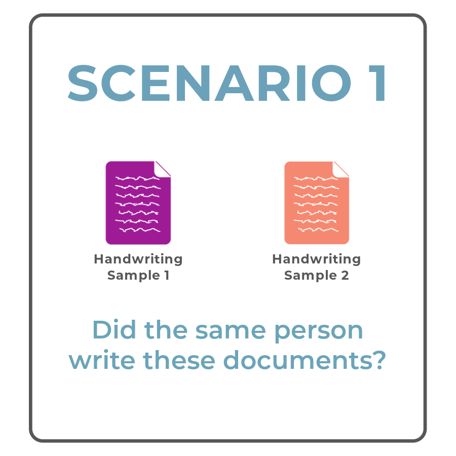
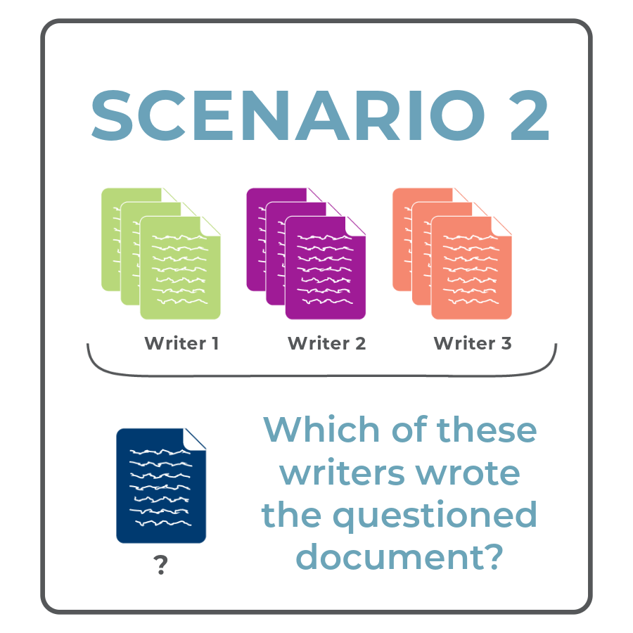

Handwriter uses two statistical methods and each method addresses a particular scenario.

::: band-dark
{fig-align="center" width="50%"}

## Compare Two Documents

A document examiner has two handwritten documents. They might know who wrote one of the documents, or they might not know who wrote either document. The examiner wants to know whether the documents were written by the same person.

### Examples

- Handwritten notes were given to bank tellers during two bank robberies. Were the notes written by the same person?
- A handwritten threat letter is received by a victim. The police have known writing from person of interest. Did the person of interest write the threat letter?

### Requirements

- Two writing samples, each at least a sentence in length.
- One or both samples may be questioned writing.

:::

::: band-light
{fig-align="center" width="50%"}

## Compare a QD to Known Writing Samples

A document examiner has a handwritten document from an unknown writer and a *closed set* of potential writers, where the document must have been written by one of the potential writers.

### Examples

- A handwritten threat letter is found in a prison. The closed-set of potential writers is people who had access to the prison.
- A handwritten threat is found on a wall in the girls bathroom at a high school after the sophomore class's lunch break. The closed-set of potential writers are the sophomore girls at the high school.

### Requirements

- **Questioned Writing**: At least a sentence in length.
- **Known Writing**: Three known writing samples from each writer in a group of potential writers. Each known writing sample must be at least a paragraph long. The questioned document MUST have been written by someone in this group.

:::
